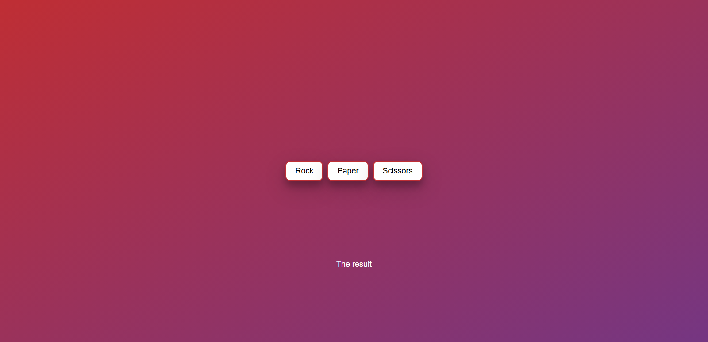

# Rock-Paper-Scissors Game 🎮

A responsive, fun, and interactive Rock-Paper-Scissors game built with **HTML**, **CSS**, and **JavaScript**. This project showcases basic game logic, event handling, and responsiveness in a clean, simple design.

## 📸 Screenshots

## 🚀 Features
- **Responsive Design:** Works seamlessly across devices.
- **Simple Gameplay:** Click buttons to play against the computer.
- **Randomized Results:** Each game is unique.
- **Minimalistic UI:** Clean, user-friendly interface.

## 🛠️ Technologies Used
- **HTML** for structure.
- **CSS** (embedded within the project) for styling and responsiveness.
- **JavaScript** for logic and interactivity.

## 📝 How to Play
1. Choose **Rock**, **Paper**, or **Scissors** by clicking on the respective button.
2. The computer will make its choice randomly.
3. Results are displayed below the buttons.

## 🧩 How It Works
- **Random Logic:** The computer's choice is determined using `Math.random()`.
- **Event Listeners:** Button clicks trigger the game's logic.
- **Result Display:** Results are updated dynamically on the webpage.

## 🚧 Future Improvements
- Add more styling for better visual appeal.
- Include animations for user interaction.
- Display a scoreboard to track the game's progress.

## 🤝 Contributing
Contributions are welcome! Feel free to fork this repo, make changes, and submit a pull request.

## 📄 License
This project is open source and available under the MIT License.
